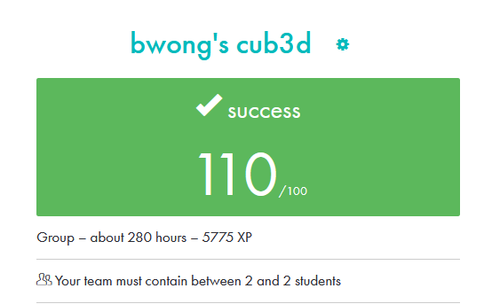

# 42-cub3d

A project inspired by the iconic 90s game, known as the first-ever FPS (First-Person Shooter). Written in C and utilizing the MiniLibX graphical library, the project uses ray-casting to create a dynamic, immersive experience as players navigate through a maze.

## Game Requirement

• This project must be created in group of 2 people (groupmate: [ctchen42] (https://github.com/ctchen42)). \
• The management of your window must remain smooth: changing to another win-
dow, minimizing, etc.\
• Display different wall textures (the choice is yours) that vary depending on which
side the wall is facing (North, South, East, West).\
• Your program must be able to set the floor and ceiling colors to two different ones.\
• The program displays the image in a window and respects the following rules:\
 ◦ The left and right arrow keys of the keyboard must allow you to look left and right in the maze.\
 ◦ The W, A, S, and D keys must allow you to move the point of view through the maze. \
 ◦ Pressing ESC must close the window and quit the program cleanly.\
 ◦ Clicking on the red cross on the window’s frame must close the window and quit the program cleanly.\
 ◦ The use of images of the minilibX is strongly recommended

## Game Preview (on Linux Only)

## Final Marks

